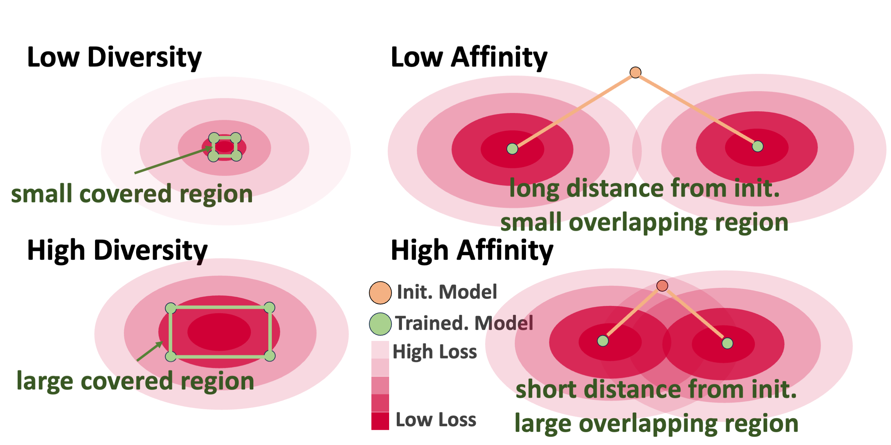

# Local Superior Soups
The official Pytorch implementation of paper "[Local Superior Soups: A Catalyst for Model Merging in Cross-Silo Federated Learning](https://arxiv.org/abs/2410.23660)" accepted to NeurIPS 2024.

Authors: [Minghui Chen](https://chenminghui.com/), [Meirui Jiang](https://meiruijiang.github.io/MeiruiJiang/), [Xin Zhang](https://xinzhang-nac.github.io/), [Qi Dou](https://www.cse.cuhk.edu.hk/~qdou/), [Zehua Wang](https://www.cse.cuhk.edu.hk/~qdou/), [Xiaoxiao Li](https://xxlya.github.io/xiaoxiao/).

## Abstract
Federated Learning (FL) enables collaborative model training using decentralized data. While pre-trained models have boosted FL performance, their growing size increases communication costs during adaptation. To tackle this, we introduce **Local Superior Soups**, a novel method that improves local training by leveraging **optimizable model interpolation**, incorporating measures of **affinity** and **diversity** to quantify model quality. Our approach helps clients explore low-loss solutions with fewer communication rounds, **making pre-trained models more communication-efficient for FL**. 



## Local Superior Soups Algorithm Overview

### Inputs
- **$f_p$**: Pre-trained model (for $R = 1$) or global aggregated model (for $R > 1$)
- **$L$**: Loss function
- **$D$**: Dataset
- **$\text{dist}$**: Distance function
- **$\tau$**: Number of iteration steps
- **$\eta$**: Learning rate
- **$\lambda_a$**: Affinity coefficient
- **$\lambda_d$**: Diversity coefficient
- **$n$**: Number of averaged models

---

### Local Training Procedure
1. **Initialization**:
   - Set $M \gets \{f_p\}$.

2. **Model Update**:
   - For each model $f_{p_i}$ from $1$ to $N$:
     1. Update model using averaging:
        - $f_{p_i} \gets \text{Averaging}(M)$.
     2. Add the updated model to $M$:
        - $M \gets M \cup \{f_{p_i}\}$.
     3. Perform sequential training for $\tau$ steps:
        - For $t = 1$ to $\tau$:
          1. Sample an interpolated model:
            $f_s \gets \text{RandomInterpolation}(M)$ (connectivity-preserving).
          2. Compute the regularized loss:
            $$L_{\text{reg}}(f_{p_i}) = L(f_s, D) + \lambda_a \cdot \text{dist}(f_{p_i}, f_p) - \lambda_d \cdot \text{dist}(f_{p_i}, M)$$
          3. Update the model:
            $$f_{p_i} \gets f_{p_i} - \eta \cdot \nabla_{f_{p_i}} L_{\text{reg}}(f_{p_i})$$

---

### Inference
1. Compute the final model using averaging:
   - $f \gets \text{Averaging}(M)$.

## Dataset and Environment Preparation

```
pip install -r requirements.txt
```

## Training and Performance Evaluation
Prepare logs and saved model directories
```
mkdir results
cd system
mkdir models
```

Running the training and testing script
```
sh scripts/run.sh
```

## Acknowledgement
We develop this LSS implementaion on top of this [personalized federated learning platform](https://github.com/TsingZ0/PFLlib).

## Citation
If you find this work helpful, feel free to cite our paper as follows:
```
@inproceedings{chenlocal,
  title={Local Superior Soups: A Catalyst for Model Merging in Cross-Silo Federated Learning},
  author={Chen, Minghui and Jiang, Meirui and Zhang, Xin and Dou, Qi and Wang, Zehua and Li, Xiaoxiao},
  booktitle={The Thirty-eighth Annual Conference on Neural Information Processing Systems}
}
```
